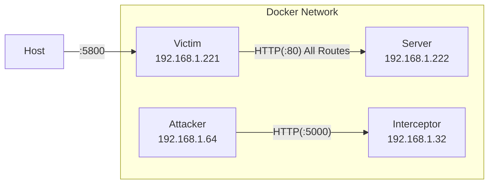

# ModITM

###### Model In the Middle attack Demo

## What is it?

This code uses a :whale: Docker :whale: based network to demonstrate an attack technique that I call Model in the Middle (ModITM for short). It creates a network of containers that looks like

The victim container exposes an interface to a firefox web browser on port `5800` to allow simulation of a user's browser. The server container exposes a simple [Bottle](https://bottlepy.org/docs/dev/) application that serves up a random image from a directory. The attacker and interceptor containers contain infrastructure to mount the model in the middle attack. Execution of the attack will morph the container network to look like:

Once the attack is running the attacker performs `NAT` and `MASQUERADE`s the traffic from the victim and passes it to the `interceptor`. The interceptor then performs an equivalent request to server to get the actual output. This output is then run through a [ResNet18](https://arxiv.org/pdf/1512.03385.pdf) model and if the resulting class is one of the `TARGET_CLASSES` the actual output is transformed (in this case to an all-black square) is returned.

## Usage

1. clone the repo
1. `mkdir images` and download the [CIFAR-10 Dataset](https://www.cs.toronto.edu/~kriz/cifar.html) into that directory
1. `docker compose -f docker-compose.victims.yaml up -d --build`
1. then, go to your browser and visit `localhost:5800`
1. in the firefox browser that opens, visit `192.168.1.222`
1. click on the captcha to see the the images
1. when you are ready to see the attack `docker compose -f docker-compose.attackers.yaml up -d --build`
1. refresh the browser and then re-select the captcha to see the attack
