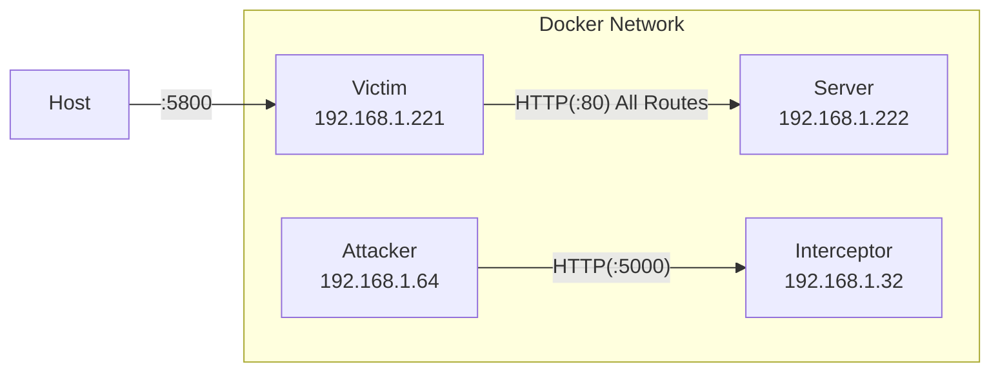
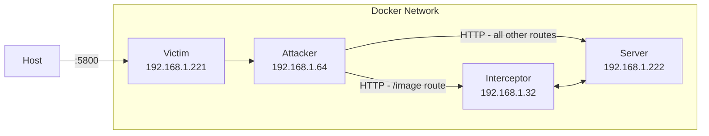

# ModITM
###### Model In the Middle attack Demo

## What is it?
This code uses a :whale: Docker :whale: based network to demonstrate an attack technique that I call Model in the Middle (ModITM for short). It creates a network of containers that looks like

The victim container exposes an interface to a firefox web browser on port `5800` to allow simulation of a user's browser. The server container exposes a simple [Bottle](https://bottlepy.org/docs/dev/)application that serves up a random image from a directory. The attacker and interceptor containers contain infrastructure to mount the model in the middle attack. Execution of the attack will morph the container network to look like:

Once the attack is running the attacker performs `NAT` and `MASQUERADE`s the traffic from the victim and passes it to the `interceptor`. The interceptor then performs an equivalent request to server to get the actual output. This output is then run through a [Yolov5](https://github.com/ultralytics/yolov5) model and if the resulting class is one of the `TARGET_CLASSES` the actual output is transformed (in this case a color negative) is returned.

## Usage
1. clone the repo
1. `docker compose up -d --build`
1. `docker exec -it attacker /bin/bash`
1. inside of the attacker container - `arpspoof -i eth0 -t 192.168.1.221 192.168.1.222